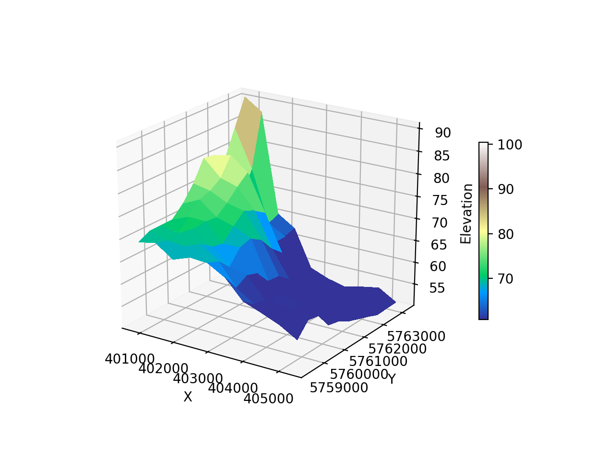

## 3D Visualization Using Matplotlib

The specific objectives of this project are:
* To visualize 3D Space Time Cube from a given GPS track
* To visualize 3D map (flying carpet) from a Digital Elevation Model (DEM)

## Results

A 3D map (flying carpet) from a small dataset of maximum 100 meters elevation in the NRW region of Germany.

Space Time Cube plot with sample dataset which is a GPX track route with latitude, longitude and time information available

## Dependencies

The project uses:

* Python v3+ 
* Matplotlib v3.0.3
* GDAL v2.3.3
* OGR v2.3.3
* Numpy v1.16.2

## Running the scripts

After installing all dependencies in your Python's environment, execute the desired script using below commands

`python demPlot3d.py` 

`python spaceTimeCube.py`

