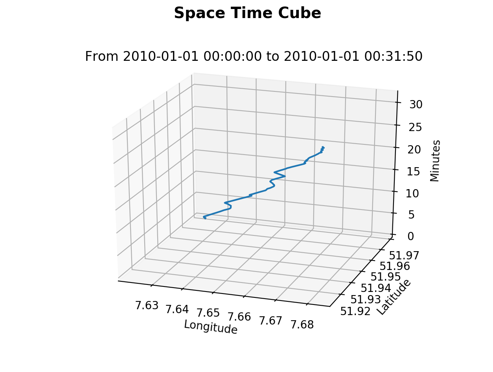

## 3D Visualization Using Matplotlib

The specific objectives of this project are:
* To visualize 3D Space Time Cube from a given GPS track
* To visualize 3D map (flying carpet) from a Digital Elevation Model (DEM)

## Results

A 3D map (flying carpet) from a small dataset of maximum 100 meters elevation in the NRW region of Germany.

Space Time Cube plot with sample dataset which is a GPX track route with latitude, longitude and time information available

